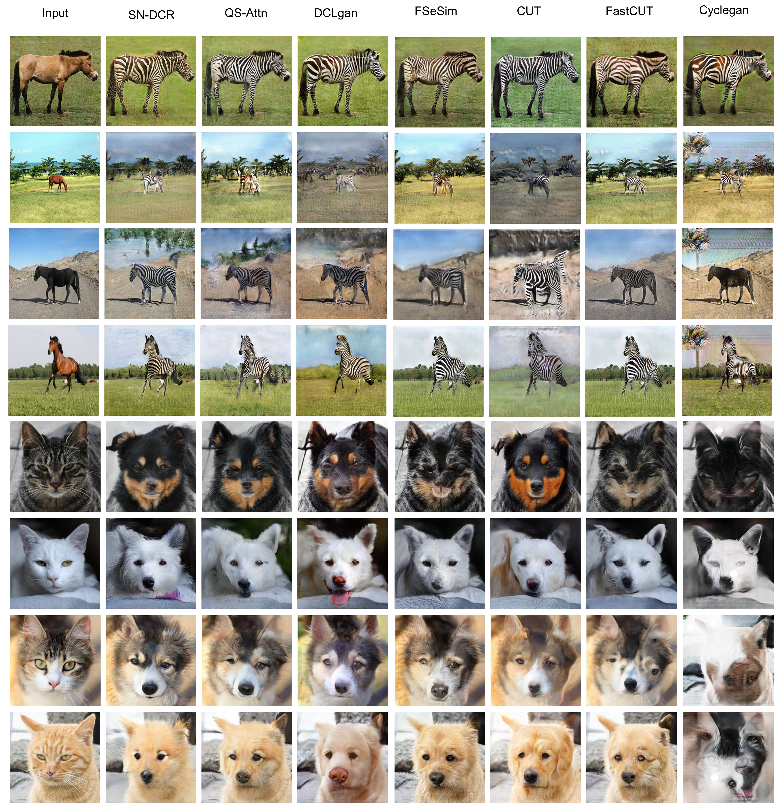

# Spectral Normalization and Dual Contrastive Regularization for Image-to-Image Translation
 
>Existing image-to-image (I2I) translation methods achieve state-of-the-art performance by incorporating the patch-wise contrastive learning into Generative Adversarial Networks. However, patch-wise contrastive learning only focuses on the local content similarity but neglects the global structure constraint, which affects the quality of the generated images. In this paper, we propose a novel unpaired I2I translation framework based on dual contrastive regularization and spectral normalization, namely SN-DCR. To maintain consistency of the global structure and texture, we design the dual contrastive regularization using different deep feature spaces respectively. In order to improve the global structure information of the generated images, we formulate a semantically contrastive loss to make the global semantic structure of the generated images similar to the real images from the target domain in the semantic feature space. We use Gram Matrices to extract the style of texture from images. Similarly, we design style contrastive loss to improve the global texture information of the generated images. Moreover, to enhance the stability of model, we employ the spectral normalized convolutional network in the design of our generator. We conduct the comprehensive experiments to evaluate the effectiveness of SN-DCR, and the results prove that our method achieves SOTA in multiple tasks.

<p align="center">

<br></p>

<p align="center">

<br>

<p align="center">

<br>

Visual comparison with all baselines in single-direction I2I task
</p>

## Getting Started
### Prerequisites
- Ubuntu 16.04
- NVIDIA GPU + CUDA CuDNN
- Python 3
Please use `pip install -r requirements.txt` to install the dependencies.

## Pretrained Models
We provide  pretrained models for three datasets.
   
| Model | Van Gogh2Photo | Horse2zebra | Cat2Dog |

| SN-DCR | [Van Gogh2Photo](https://pan.baidu.com/s/1V71ySjRP7Nf789-cxVWEGA) | [Horse2zebra](https://pan.baidu.com/s/1eteFN_gEy_ms4VJaYkflLA) | [Cat2Dog](https://pan.baidu.com/s/17wTroinfc0bgEY2omkkoNQ)

提取码:az14

## Training
- Download `horse2zebra` dataset :
```
bash ./datasets/download_sndcr_dataset.sh horse2zebra
```
- Train the global model:
```
python train.py \
--dataroot=datasets/horse2zebra \
--name=horse2zebra_sndcr \
```
- You can use visdom to view the training loss:
Run `python -m visdom.server` and click the URL http://localhost:8097.

## Inference
- Test the global model:
```
python test.py \
--dataroot=datasets/horse2zebra \
--name=horse2zebra_sndcr \
--mode=sndcr
```
